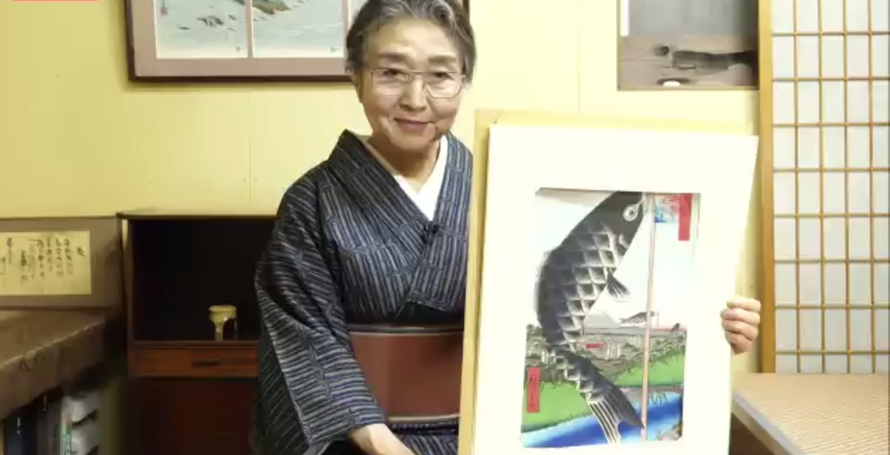
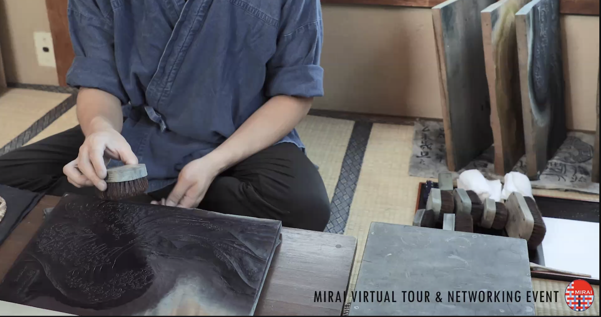

Here you will find several entries on the MIRAI academic exchange program, on
which I have the pleasure to participate. This
program is conducted by the Japanese Ministry of Foreign Affairs (MoFA) and
promotes mutual understanding between the Japanese and European societies.

## Ukiyo-e lecture

On March the 11th I participated in a quite interesting talk by Ms. Yukiko
Takahashi, from Takahashi Kobo, a Ukiyo-e studio in Tokio, during a MIRAI alumni
meeting. This studio was founded 160 years ago during the Edo period, and
preserves the printing techniques from those times. Ms. Takahashi took us on a
(virtual) tour in the studio, and we were able to watch how a reproduction of
Hokusai's *Great Wave* was made. However impressive this was, which is to say
quite a lot, what I found most interesting was Ms. Takahashi's comments on
several Ukiyo-e prints, indicating that there are in them many things to learn
from the life in Japan during the Edo period.

## Hatsu-Zoomu!

On this saturday the 15th of january took place the first meeting among
participants of the MIRAI program; which fosters the relations among
Japan and Europe through a short exchange between students of both regions.
Unfortunately is Japan, as the rest of the world, not exempt of Covid, so we
will not be able to visit the Land of the Rising Sun in the immediate future.
However, I do think the most important aspect of the program is that it allows
us getting to know interesting people from both Europe and Japan, and the wealth
of talks we will atend, ranging from the Japanese exterior policy to Japanese
culture and costumes. And those are not going away with Covid.

On this first day, I got to know a few of my European fellows on the Science and
Technology group, and found them to be really interesting people,
with expertise ranging from undergraduate - like myself - to PhD's, and summing
up to an eclectic mix of study areas: Arquitecture, Genomics, Computer
Science, ...

Two very sort talks were held: one by Mr. SAITO Atsushi, director of MoFA's
European Division, welcoming us to the program, and one by [Mr. Stuart Varnam-Atkin](https://japantoday.com/category/features/executive-impact/selling-english-the-work-of-a-skilled-chameleon), on understandig Japan.

